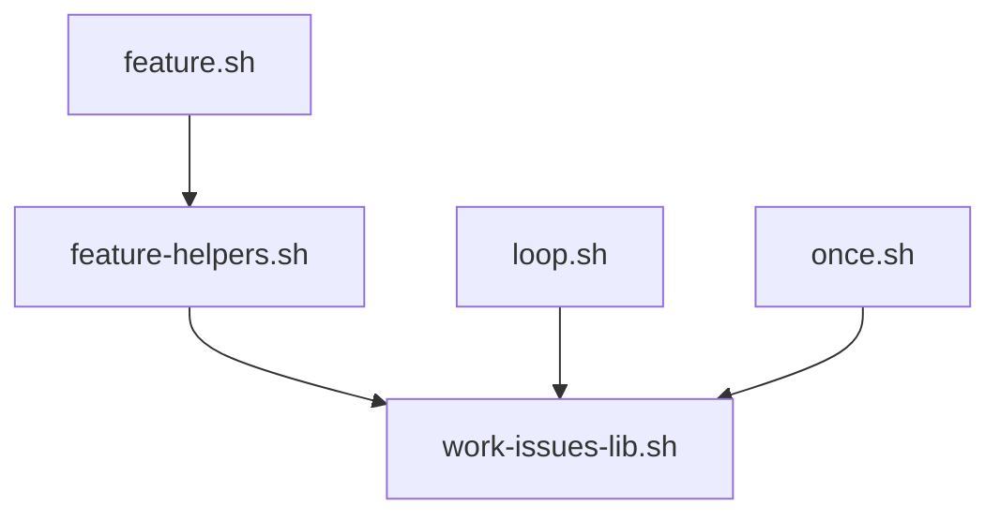

```yaml
last-mapped: 8684bac
mode: incremental
generated: 2026-05-27
```

# ARCHITECTURE

## Structure

A Claude Code plugin marketplace. The primary plugin is `plugins/agentic-engineering/` (20 composable skills covering the PRD → issues → autonomous-work pipeline plus design / debug / review / document phases). Two smaller plugins (`audit-agent-overhead`, `claude-md-audit`) and a non-plugin `statusline/` ship alongside.

```
/Users/matt/Projects/claude-skills/
├── .claude-plugin/marketplace.json        # marketplace manifest
├── .claude/hooks/                         # repo-local PreToolUse / Stop hooks
│   ├── block-secrets.sh
│   ├── format-on-write.sh
│   └── test-on-stop.sh
├── CLAUDE.md                              # routing map (read by every skill)
├── CONTEXT.md                             # domain glossary
├── README.md
├── pyproject.toml                         # python deps for crap (lizard, pytest)
├── plugins/
│   ├── agentic-engineering/
│   │   ├── SKILLS.md                      # per-skill detail table
│   │   ├── ATTRIBUTION.md
│   │   ├── licenses/                      # MIT / Apache 2.0 source licenses
│   │   └── skills/
│   │       ├── feature/{SKILL.md,bin/,evals/}
│   │       ├── work-issues/{SKILL.md,bin/}
│   │       ├── crap/{SKILL.md,crap.py,detectors.md,refactor-playbook.md}
│   │       ├── map/SKILL.md
│   │       ├── write-a-prd/, prd-to-issues/, write-a-spec/, write-a-rubric/
│   │       ├── grill-me/, grill-with-docs/, prototype/, tdd/
│   │       ├── diagnose/, evolve/, improve-codebase-architecture/
│   │       ├── adversarial-review/, zoom-out/
│   │       └── {feature,prd-to-issues,write-a-rubric}-workspace/
│   ├── audit-agent-overhead/skills/audit-agent-overhead/{SKILL.md,bin/,patterns.md}
│   └── claude-md-audit/hooks/{check-claude-md.sh,lint-claude-md.sh}
├── statusline/claude-statusline.sh        # non-plugin extra
├── tools/                                 # repo-level utilities
│   ├── benchmark.sh, benchmark-summary.sh, estimate-cost.sh
│   └── generate-claude-md.sh, lint-claude-md.sh
├── tests/                                 # shell + python integration tests
│   ├── test_crap.py
│   ├── test_feature_helpers.sh
│   ├── test_feature_orchestrator.sh
│   └── test_work_issues_lib.sh
├── docs/{adr/,lessons-learned/,plans/}
└── issues/{prd.md,done/}                  # dogfooded local issue queue
```

**Key entry points:**

- `plugins/agentic-engineering/skills/feature/bin/feature.sh` — `/feature` orchestrator (803 lines, three human checkpoints, resumable state machine)
- `plugins/agentic-engineering/skills/work-issues/bin/loop.sh` — AFK headless loop runner
- `plugins/agentic-engineering/skills/work-issues/bin/once.sh` — single supervised iteration
- `plugins/agentic-engineering/skills/work-issues/bin/work-issues-lib.sh` — shared library (sourced, never executed)
- `plugins/agentic-engineering/skills/feature/bin/feature-helpers.sh` — state-machine helpers (sources work-issues-lib.sh)
- `plugins/agentic-engineering/skills/crap/crap.py` — CRAP-score ranker
- `plugins/audit-agent-overhead/skills/audit-agent-overhead/bin/audit.sh` — standalone overhead auditor
- Hooks: `.claude/hooks/block-secrets.sh`, `.claude/hooks/format-on-write.sh`, `.claude/hooks/test-on-stop.sh`
- Tests: `tests/test_feature_helpers.sh`, `tests/test_feature_orchestrator.sh`, `tests/test_work_issues_lib.sh`, `tests/test_crap.py`

## Dependencies

**Shell-script source chain:**



**External dependencies:**

| Tool | Used by | Required? |
| --- | --- | --- |
| bash 4+ | every `bin/*.sh` (associative arrays) | yes |
| jq | `feature.sh` state I/O, `loop.sh` JSON stream parsing | yes (loop), graceful fallback (feature) |
| python 3 + `lizard` | `crap.py` complexity scoring | yes for `/crap` |
| pytest, coverage | `tests/test_crap.py` | dev only |
| ripgrep (`rg`) | several skills (find-replace, grep) | optional, GNU grep fallback |
| `claude` CLI | `feature.sh` step dispatch, `loop.sh` headless invocation | yes for orchestrators |

**Key Interfaces** (high fan-in shell helpers — change carefully):

- `plugins/agentic-engineering/skills/work-issues/bin/work-issues-lib.sh:54` — `strip_frontmatter <file>`
- `plugins/agentic-engineering/skills/work-issues/bin/work-issues-lib.sh:64` — `list_issue_files <dir>`
- `plugins/agentic-engineering/skills/work-issues/bin/work-issues-lib.sh:73` — `allowlist_for <spec> <lane>` (parses H3 lane headings + fenced `paths` blocks from `*.spec.md`)
- `plugins/agentic-engineering/skills/work-issues/bin/work-issues-lib.sh:110` — `route_findings <findings> <spec>`
- `plugins/agentic-engineering/skills/feature/bin/feature-helpers.sh:39` — `state_read <path>`
- `plugins/agentic-engineering/skills/feature/bin/feature-helpers.sh:45` — `state_write <path> <json>` (atomic, write-tmp-then-rename)
- `plugins/agentic-engineering/skills/feature/bin/feature-helpers.sh:70` — `acquire_lock <pidfile> <pid>`
- `plugins/agentic-engineering/skills/feature/bin/feature-helpers.sh:86` — `release_lock <pidfile>`

## Conventions

- **Skill schema** — each skill lives at `plugins/<plugin>/skills/<name>/SKILL.md` with YAML frontmatter: `name` (required), `description` (required, quoted to escape `colon-space`), optional `disable-model-invocation: true` for slash-only skills, optional `allowed-tools` whitespace-separated list. Body is markdown after the closing `---`.
- **Sidecar suffix convention** — sidecars attach to a story file by suffix: `issues/NNN-*.spec.md` (write-a-spec), `issues/NNN-*.rubric.md` (write-a-rubric), `issues/NNN-*.research.md` (Explore researcher dump). All travel into `issues/done/` together when the story closes.
- **Timestamps in state.json** — ISO-8601 with `Z` suffix (UTC), written by `state_write` in `feature-helpers.sh`. Atomic file writes (`.tmp` then rename) prevent torn state on crash.
- **Lane labels** — H3 headings in `*.spec.md` (e.g. `### Backend`, `### Frontend`) must match labels declared in `CLAUDE.md` ## Lane boundaries. In **this repo** the labels are illustrative only (used by `tests/test_feature_orchestrator.sh`); downstream consumers redefine them in their own `CLAUDE.md`.
- **Commit-message style** — conventional commits (`feat:`, `fix:`, `refactor:`, `rename:`, `docs:`, `test:`). Per `~/.claude/CLAUDE.md` rule: **Claude is never a co-author** on this repo's commits.
- **Test-file convention** — `tests/test_*.sh` for shell (sourced helper-under-test, exit non-zero on assertion fail), `tests/test_*.py` for python (pytest). `test-on-stop.sh` hook runs them on agent Stop.
- **Symlink installation** — per `README.md`, plugins are installed as symlinks from `~/.claude/plugins/` to the working tree so edits go live without reinstalling.
- **Heavyweight skills are slash-only** — `feature`, `map`, `zoom-out` carry `disable-model-invocation: true` in frontmatter; `work-issues`, `adversarial-review` are enforced slash-only via skill description ("Use only when explicitly asked") rather than the frontmatter flag.

## Change Impact Map

### High-Coupling Zones

| Hotspot | Fan-in | Who depends on it | Why it matters |
| --- | --- | --- | --- |
| `plugins/agentic-engineering/skills/work-issues/bin/work-issues-lib.sh` | **3 direct** (transitively 4) | `feature-helpers.sh`, `loop.sh`, `once.sh` (and `feature.sh` via helpers) | Changes ripple to every orchestrator entry point; helper-function rename or signature break silently corrupts spec parsing / allowlist enforcement. |
| `plugins/agentic-engineering/skills/feature/bin/feature-helpers.sh` | 1 direct | `feature.sh` | Single consumer, but transitively critical: owns the state-machine atomicity (`state_read`/`state_write`) and the cross-session lock. A break here strands a `/feature` run mid-pipeline. |
| `CLAUDE.md` (routing map + Lane boundaries) | **all skills** | every skill reads this on load | Lane labels here are the contract `allowlist_for` consumes. Changing a heading silently invalidates every `*.spec.md` that uses the old label. |
| `issues/NNN-*.spec.md` H3 lane labels | parsed by | `work-issues-lib.sh::allowlist_for` | Producer = `write-a-spec` skill, consumer = `feature.sh` lane builder. **Case-sensitive contract**: H3 label must match `CLAUDE.md ## Lane boundaries` char-for-char. `feature.sh:step_lane` normalizes its passed-in lane name to lowercase via `lane_normalize` before calling `allowlist_for`, so the canonical form is whatever case CLAUDE.md uses (lowercase in claude-skills). Schema drift = wrong files become editable, OR worse: empty allowlist + silent skip. |
| Hooks under `.claude/hooks/` | all sessions in this repo | `format-on-write.sh`, `test-on-stop.sh`, `block-secrets.sh` fire on every matching tool call | A noisy or slow hook degrades every interaction; `block-secrets.sh` is a safety boundary, not a soft warning. |

### Safe Zones

These have low fan-in and can be edited with confidence (only their own tests / hooks regress):

- `plugins/audit-agent-overhead/` — standalone plugin, no shared code with `agentic-engineering`.
- `plugins/claude-md-audit/` — hook-only plugin, no skills consume it.
- `statusline/claude-statusline.sh` — cosmetic, no callers in repo.
- `tools/` — `benchmark.sh`, `estimate-cost.sh`, `generate-claude-md.sh`, `lint-claude-md.sh` are repo-level utilities; nothing inside `plugins/` imports them.
- Most `agentic-engineering/skills/*/SKILL.md` bodies (excluding `feature`, `work-issues`, `write-a-spec`) — markdown-only, no shared shell library.
- `docs/`, `issues/done/`, `CONTEXT.md` — read-only references; no executable consumers.
