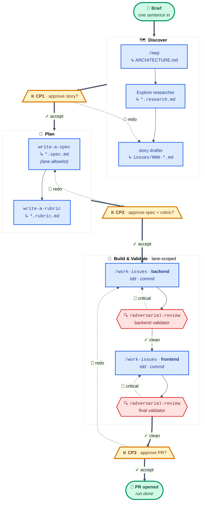

# claude-skills

A marketplace of individually-installable plugins for [Claude Code](https://claude.ai/claude-code). Each plugin stands alone — install only what you need.

## Install

Add the marketplace once:

```
/plugin marketplace add belchman/claude-skills
```

Then install any subset:

```
/plugin install agentic-engineering@belchman-claude-skills
/plugin install agent-loop@belchman-claude-skills
/plugin install audit-agent-overhead@belchman-claude-skills
/plugin install claude-md-audit@belchman-claude-skills
```

## Plugins

### `agentic-engineering` — the build / review / debug pipeline

Composable skills grouped by **phase of work**: PRD → issues → spec → rubric → autonomous work — orchestrated end-to-end by `/feature`, or piece-by-piece by hand. Plus design interrogation, TDD, deep-module refactoring, evolutionary search, CRAP reduction, debugging, adversarial review, and ARCHITECTURE.md mapping.

| Phase | Skills | Purpose |
| --- | --- | --- |
| **1. Pipeline** | `write-a-prd`, `prd-to-issues`, `write-a-spec`, `write-a-rubric`, `/work-issues`, `/feature` | Brief → PRD → issues → spec → autonomous work, or `/feature` to orchestrate the whole chain on one brief |
| **2. Design** | `grill-with-docs`, `grill-me`, `prototype` | Stress-test plans before any code changes |
| **3. Implement** | `tdd`, `improve-codebase-architecture`, `evolve` | Move the code itself |
| **4. Debug** | `diagnose`, `/zoom-out` | Find and fix what's broken |
| **5. Review** | `/adversarial-review`, `crap` | Audit existing code for gaps and risk |
| **6. Document** | `/map` | Keep `ARCHITECTURE.md` current |

Full per-skill table: [`plugins/agentic-engineering/SKILLS.md`](plugins/agentic-engineering/SKILLS.md). Routing decision tree: [`CLAUDE.md`](CLAUDE.md). Heavyweight skills (`/work-issues`, `/zoom-out`, `/adversarial-review`, `/map`, `/feature`) are slash-only by intent; `/feature` and `/zoom-out` enforce via `disable-model-invocation: true` frontmatter, the others via description prose so `/feature` can dispatch them programmatically.

Convention: skills produce/consume a small set of files (`issues/*.md`, `issues/NNN-*.rubric.md`, `rubrics/*.md`, `CONTEXT.md`, `docs/adr/*.md`, `ARCHITECTURE.md`). Several skills are vendored from [`mattpocock/skills`](https://github.com/mattpocock/skills) (MIT) and [`GAIR-NLP/ASI-Evolve`](https://github.com/GAIR-NLP/ASI-Evolve) (Apache 2.0) — full attribution in [`plugins/agentic-engineering/ATTRIBUTION.md`](plugins/agentic-engineering/ATTRIBUTION.md).

#### Notable: `/feature`

End-to-end orchestrator. One brief in, a vertically-sliced feature out, **three human checkpoints** between (approve story, approve spec+rubric, approve PR). Two invocation modes share the same artifact contract:

- **In-conversation** (default — when you type `/feature` inside Claude Code). Every step dispatches a forked Agent subagent so output is visible inline, per-step model selection is possible (Haiku for read-heavy steps, Sonnet for spec/rubric writers, parent model for code), and checkpoints pause via `AskUserQuestion` right in the conversation.
- **Headless** (when you run `feature.sh start` directly from a shell). Each step runs as a separate `claude -p` subprocess cache-hot via `--resume <parent_sid> --fork-session`. Pauses by exiting between steps. Resume via `feature.sh continue <id>`. Survives terminal close, machine reboot, week-long pauses.

State journaled to `.feature_runs/<id>/state.json` after every step in both modes — an in-conversation run can be aborted to disk and resumed via `feature.sh continue <id>` (or vice versa).



**Solid arrows** = forward progress. **Dotted arrows** = `--redo` (user requested a re-run) or critical-finding loopback (validator caught something; orchestrator re-invokes the lane). **Hexagonal validators** read the diff after each lane and route Critical findings back into the lane that owns the failing path. **Trapezoid checkpoints** are the three human gates — accept advances to the next phase, redo reruns with feedback.

**In-conversation** (default):

```
/feature "Add invoice reminders for invoices unpaid >7 days"
```

Claude reads the SKILL.md, computes a run id, dispatches a forked Agent subagent per step, and pauses at each checkpoint with an inline `AskUserQuestion`. Per-step models can be overridden naturally: `/feature Build X. Use opus for the spec, haiku for the validators, sonnet for everything else.` — the orchestrator parses that, echoes the resolved 9-row model table for you to correct, then proceeds.

**Headless** (when you'll close the terminal — say "AFK" / "overnight" / "I'm closing my laptop" and the in-conversation skill bash-invokes the script automatically, or run it yourself):

```
feature.sh start "Add invoice reminders for invoices unpaid >7 days"
# → creates run id, drafts research + story, exits at Checkpoint 1
feature.sh continue <id> --accept              # advance through to next checkpoint
feature.sh continue <id> --redo "<feedback>"   # re-run the current step with feedback
feature.sh abort <id>                          # give up, release LOCK
feature.sh status <id>                         # human-readable state.json
```

Slash-only; auto-invocation guarded by `disable-model-invocation: true`. Full chain + failure modes: [`docs/plans/feature-factory.md`](docs/plans/feature-factory.md). Build retrospective: [`docs/lessons-learned/feature-factory-build.md`](docs/lessons-learned/feature-factory-build.md).

#### Notable: `/map`

Generates or updates an `ARCHITECTURE.md` at the root of your repository: a living map of structure, dependencies, conventions, and high-coupling zones. Polyglot-adaptive; dispatches parallel agents; incremental via `git diff`; flags high-risk zones by fan-in.

```
/map                  # first run or incremental update
/map --full           # force full regeneration
/map --section deps   # update one section (structure | deps | conventions | impact)
```

#### Notable: `/adversarial-review`

Three parallel reviewer agents (spec, config, coverage) against your project's docs, config, and tests — find contradictions, gaps, and missing pieces, then fix what you approve. Uses `ARCHITECTURE.md` (from `/map`) for blast-radius analysis when available.

```
/adversarial-review                 # full review
/adversarial-review --diff          # only what changed since last /map
/adversarial-review path/to/file    # specific file or glob
```

#### Notable: `crap`

Ranks functions by CRAP score (cyclomatic complexity × lack of real test coverage) on the current branch, then proposes either a refactor or missing tests for the worst offender.

- CRAP = `cc² × (1 − eff_cov)³ + cc`, where `eff_cov = line_cov × mutation_kill_rate`
- Cache + baseline on disk so repeat runs are fast and regressions are gated
- Per-language detectors for coverage/mutation (Python, JS/TS, Go, Rust, Java/Kotlin, C/C++) — see [`detectors.md`](plugins/agentic-engineering/skills/crap/detectors.md)
- After ranking, offers a language-aware refactor or a test-case draft for the single worst function

```
/crap                   # changed-files scope, threshold from .crap.yml or 30
/crap 20                # threshold override
/crap --full            # whole tree
/crap --dry-run         # skip refactor/tests step
/crap --set-baseline    # write .crap-baseline.json and exit
```

**Dependencies.** `/crap` needs `python3` and `lizard` (`pip install lizard`). Coverage and mutation tools are language-specific and installed on demand — the skill prints the exact install command when something is missing. See [`crap.yml.example`](plugins/agentic-engineering/skills/crap/crap.yml.example) for project configuration.

**Theory.** The CRAP metric is Alberto Savoia's 2007 proposal ([original post](https://www.artima.com/weblogs/viewpost.jsp?thread=215899)). Threshold of 30 and the "≤ 5% of methods above threshold or the project is crappy" rule both come straight from his paper. **Deviation from Savoia.** He specified *basis path coverage*. This skill substitutes `line_cov × mutation_kill_rate` for `eff_cov` — directly addressing the weakness Savoia himself flagged: *"[CRAP] cannot detect great code coverage and lousy tests."* Mutation kill rate exposes exactly that case.

**Dogfood.** This repo runs `/crap` against itself:

| Metric | Before | After |
|---|---:|---:|
| Functions above CRAP 30 | 17 / 40 (42.5%) | **0 / 47 (0.0%)** |
| Worst offender CRAP | 2162 (`cmd_score`) | 26.4 (`_read_arg_signature`) |
| Line coverage | 0% | **89%** |
| Mutation kill rate | — | **76%** (1432 / 1889) |
| Savoia verdict | CRAPPY | **clean** |

To reproduce locally from the repo root:

```bash
pip install lizard coverage mutmut pytest

# 1. Tests + coverage
coverage run --source=plugins/agentic-engineering/skills/crap -m pytest tests/ -q
coverage json -o /tmp/coverage.raw.json

# 2. Mutations (writes mutants/ — gitignored)
mutmut run

# 3. Pipeline
python3 plugins/agentic-engineering/skills/crap/crap.py lizard plugins/agentic-engineering/skills/crap/crap.py -o /tmp/fns.json
python3 plugins/agentic-engineering/skills/crap/crap.py filter --functions /tmp/fns.json --threshold 30 > /tmp/surv.json
python3 plugins/agentic-engineering/skills/crap/crap.py normalize-coverage --tool coveragepy /tmp/coverage.raw.json -o /tmp/coverage.json
python3 plugins/agentic-engineering/skills/crap/crap.py score \
    --functions /tmp/fns.json --survivors /tmp/surv.json \
    --coverage /tmp/coverage.json --mutation /tmp/mutation.json \
    --no-churn --no-baseline --threshold 30
```

---

### `agent-loop` — goal-driven loop harness

One command builds the Claude Code harness plane (CLAUDE.md stub, merged settings, self-gating hooks, planner/worker/verifier/optimizer agents, a verify skill, memory + vault) in **any repo**; then goal-spec-driven **plan → act → verify → optimize** loops run on top of it — interactively or from a scheduler. Every iteration ends with a fresh-context optimizer proposing spec and verify improvements for the next pass (report-only — the human applies them; the loop never edits its own contract).

```
/agent-loop init          # build the harness plane (idempotent; shows a settings diff first)
/agent-loop new "<goal>"  # interview → GOAL.md + goal.json; refuses to finish without a locked Decision
/agent-loop run           # one plan→act→verify iteration; plans await human approval
/agent-loop status        # is the loop converging?
/agent-loop doctor        # harness health, checks D01–D16 (CI-friendly exit codes)
/agent-loop watch         # local dashboard (single repo); bare al-watch = machine-wide fleet console
```

Plans are pressure-tested by a *different model* (`loop-critic`, per-goal `critic_model`) and revised up to twice before pausing `awaiting-human` (`/agent-loop approve` / `reject "<reason>"`) — the gate refuses un-critiqued proposals. Passes are re-verified at the state layer, so the loop can't self-certify, and every event lands in an append-only, **hash-chained, secrets-redacted** `audit.jsonl` with actor attribution. TDD is on by default: the state layer must observe the driving test *fail* (`al-state tdd-red`) before implementation work, and observe the same command *pass* before the iteration can record — red→green, enforced, not advised. Enterprise controls ship in the box: org-managed `policy.json` floors the goal author can't lower, an atomic run lease, token budgets, a scheduler circuit breaker, webhook notifications when the loop blocks on a human, and `al-fleet` for multi-repo visibility. Headless ticks via `bin/al-loop.sh` (cron / launchd / systemd / GitHub Actions) cost zero tokens when there's nothing to do.

**When to pick which:** `/feature` drives one *brief* through the PRD→issues pipeline with three fixed checkpoints; `/work-issues` drains an existing `issues/` queue; `/agent-loop` iterates one *open-ended goal* in any repo, gating every plan; `evolve` searches when "done" is a score rather than a checklist. When `agentic-engineering` is installed, agent-loop delegates its interview to `grill-with-docs`, rubric authoring to `write-a-rubric`, test-shaped tasks to `tdd`, and deep verification to `adversarial-review` — and it runs fully standalone without it.

Full docs (worked example, scheduling recipes, statusline): [`plugins/agent-loop/README.md`](plugins/agent-loop/README.md). Design: [`docs/agent-loop-design.md`](docs/agent-loop-design.md). Slash-only via `disable-model-invocation: true`.

---

### `audit-agent-overhead` — slash command `/audit-agent-overhead`

Walks `~/.claude`, the current project, and plugin scope looking for the 9 token-waste patterns that silently inflate Claude Code cost: noisy hooks, oversized SKILL.md files, ambient context drift, unbounded transcripts, redundant agents, and friends. Slash-only — runs only on explicit invocation.

```
/audit-agent-overhead
```

---

### `claude-md-audit` — PreToolUse hook

A `PreToolUse` hook that lints `CLAUDE.md` on every `Edit`/`Write` and blocks writes that introduce structural errors (broken frontmatter, missing required sections, conflicting routing tables). Useful when you're iterating on `CLAUDE.md` itself and want a guardrail.

See [`plugins/claude-md-audit/README.md`](plugins/claude-md-audit/README.md) for the lint rules.

---

### `claude-statusline` — bash script (not a plugin)

A two-line Claude Code statusline showing model, location, context %, **per-turn input/output tokens**, session totals, cache visibility, and cost. Color-coded context bar (green → yellow → red).

```
[Opus] claude-skills@master | effort:medium
████░░░░░░ 47% | turn ↓8.5K ↑1.2K (cache r:2.0K w:5.0K) | sess ↓45.0K ↑12.0K | $0.1234
```

Install:

```bash
curl -fsSL https://raw.githubusercontent.com/belchman/claude-skills/master/statusline/claude-statusline.sh \
  -o ~/.claude/statusline.sh
chmod +x ~/.claude/statusline.sh
```

Then add to `~/.claude/settings.json`:

```json
{ "statusLine": { "type": "command", "command": "~/.claude/statusline.sh", "padding": 1 } }
```

Schema verified against the [official docs](https://code.claude.com/docs/en/statusline). All field names null-safe. See [`statusline/README.md`](statusline/README.md) for the rationale per field, customization, and the dry-run test command.

---

## Recommended workflow

**Build (new work):**

1. `/write-a-prd` — interview, produce `issues/prd.md`
2. `/grill-with-docs` — stress-test the PRD against `CONTEXT.md` / `docs/adr/`
3. `/prd-to-issues` — break PRD into HITL / AFK issues
4. `/write-a-spec` — turn each AFK issue into a technical spec (`*.spec.md`) with file-by-file lane allowlists
5. `/write-a-rubric` — define gradeable "what done looks like" per issue worth it (`*.rubric.md`)
6. `/work-issues` (or `bin/loop.sh` for AFK) — autonomously work the queue, lane-scoped if a sibling spec is present

Or run the whole chain on a single brief via `/feature` — see below. For a single open-ended goal outside an issue queue — or a loop that ticks from a scheduler while you're away — use `/agent-loop` (separate plugin, see above).

**Quality / review (existing code):**

1. `/map` on a new project → generates `ARCHITECTURE.md`
2. `/adversarial-review` → finds gaps in docs and config
3. `/crap` → finds risky, under-tested code to address next
4. After changes, `/map --section deps` or `/adversarial-review --diff` to stay current

**Always-on:**

- Drop in `claude-statusline` so context %, per-turn tokens, and cost are always visible
- `/audit-agent-overhead` quarterly to keep token overhead under control

## Development

One entry point for everything:

```bash
make test-fast   # ~5s — pytest + marketplace-sync guard + quick bash suites (the Stop hook runs this after every turn)
make test        # ~4 min — everything above plus the agent-loop bin/hook suites and the /feature orchestrator integration tests (CI runs this)
```

`tests/test_marketplace_sync.sh` enforces that `.claude-plugin/marketplace.json`, each plugin's `plugin.json`, and this README stay in lockstep (names, versions, descriptions, install lines, section headings) and that plugin hooks use the canonical `hooks/hooks.json` layout. CI (`.github/workflows/ci.yml`) runs the full suite on every push and PR.

## License

MIT — [belchman](https://github.com/belchman)
