# claude-md-audit

A small example plugin that demonstrates how to ship a Claude Code **hook**
inside a plugin (versus pinning hooks to a single project's `.claude/`).

It runs a CLAUDE.md linter on every `Edit` or `Write` whose target basename is
`CLAUDE.md`. If the linter reports **errors** (exit code `2`), the write is
**blocked** and the lint output surfaces in the next-turn transcript. Warnings
(exit `1`) are allowed through so you aren't blocked on style nits.

## How it works

```mermaid
flowchart TD
    A[Claude attempts Edit/Write] --> B{"PreToolUse matcher<br/>Edit&#124;Write"}
    B -->|match| C[check-claude-md.sh<br/>reads tool_input JSON from stdin]
    B -->|no match| Z([tool call proceeds])
    C --> D{"basename ==<br/>CLAUDE.md?"}
    D -->|no| Z
    D -->|yes| E{"file exists<br/>on disk?"}
    E -->|no, new file| Z
    E -->|yes| F[lint-claude-md.sh path]
    F --> G{"linter exit code"}
    G -->|0 pass| Z
    G -->|1 warnings| Z
    G -->|2 errors| H[print lint output to stderr]
    H --> I([exit 2 — Claude Code<br/>blocks the write and surfaces<br/>stderr to the next turn])

    style I fill:#fee,stroke:#c00,color:#000
    style Z fill:#efe,stroke:#0a0,color:#000
```



The hook is **fail-open**: anything unexpected (missing `jq`, missing linter,
malformed JSON) exits `0` and lets the write proceed. Only an explicit
linter-reported error (`exit 2`) blocks anything.

## Why this is useful

Repos that maintain multiple `CLAUDE.md` files — monorepos, marketplaces,
starter kits — quietly drift: missing Commands section, no test info, vague
"write clean code" rules. This hook makes the drift visible at the moment of
the write, not weeks later.

## How it's wired

`hooks/hooks.json` at the plugin root — the canonical, auto-discovered
location for plugin hooks (no `plugin.json` entry needed) — registers a
PreToolUse hook:

```jsonc
{
  "hooks": {
    "PreToolUse": [
      {
        "matcher": "Edit|Write",
        "hooks": [
          { "type": "command", "command": "bash \"${CLAUDE_PLUGIN_ROOT}\"/hooks/check-claude-md.sh" }
        ]
      }
    ]
  }
}
```

The `${CLAUDE_PLUGIN_ROOT}` variable is set by Claude Code to the plugin's
install directory — so the path is install-location-agnostic.

## Files

- `.claude-plugin/plugin.json` — manifest
- `hooks/hooks.json` — hook registration (auto-discovered)
- `hooks/check-claude-md.sh` — the PreToolUse guard (extracts `file_path`
  from stdin JSON, gates on basename, delegates to the linter)
- `hooks/lint-claude-md.sh` — bundled linter so the plugin is self-contained.
  Falls back to `$CLAUDE_PROJECT_DIR/tools/lint-claude-md.sh` if the bundled
  copy is unavailable.

## What it checks

The bundled linter looks for:

- **Structure:** H1 title, Commands section, Architecture / Test / Rules sections.
- **Content quality:** length, backtick-formatted commands, vague-instruction
  smells ("write clean code", "follow best practices").
- **Common mistakes:** hardcoded secrets, absolute paths, outdated model
  references, empty sections.

Exit codes:

| Code | Meaning             | Hook behavior |
|------|---------------------|---------------|
| 0    | All checks pass     | allow write   |
| 1    | Warnings only       | allow write   |
| 2    | Errors found        | **block write** |

## Use as an example

This plugin is intentionally tiny. It exists to demonstrate:

1. The `${CLAUDE_PLUGIN_DIR}` env var for install-path-agnostic script refs.
2. Reading `tool_input` JSON from stdin in a hook.
3. Returning `exit 2` to block a tool call with stderr-surfaced reasoning.
4. Graceful degradation: if `jq` is missing, fall back to `sed`; if the
   bundled linter is unavailable, look for a project-level copy; if nothing
   resolves, allow the write rather than fail closed.

Copy and adapt the pattern for your own PreToolUse guards.

## License

MIT. The linter and hook are adapted from
[`MuhammadUsmanGM/claude-code-best-practices`](https://github.com/MuhammadUsmanGM/claude-code-best-practices)
(MIT).
